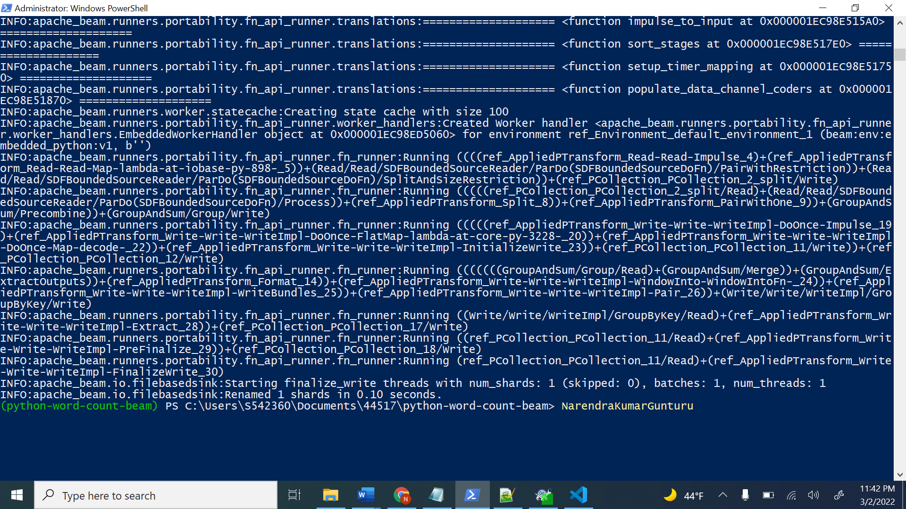
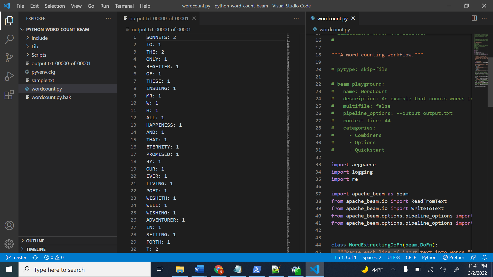

### python-word-count-beam
* Create a folder named python-word-count-beam 
* open powershell as administrator at this directory.
* Now We have to add wordcount.py and input.txt
* Check the pip version with **pip --version**
* Upgrade the Existed PiP with **python -m pip install --upgrade pip**
* Now we have to create and activate the virtual environment with
 
     **python -m venv C:\path\to\directory**

     **C:\path\to\directory\Scripts\activate.ps1**
* Install the Apache Beam with **python -m pip install apache-beam**
* Execute the wordcount.py Using **python -m apache_beam.examples.wordcount --input /path/to/inputfile --output /path/to/write/counts**

